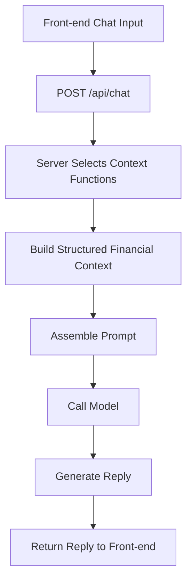

# Architecture Notes

## Why model calls go through server

The mobile app could call the model API directly, but this project routes model
calls through the server on purpose.

Main reasons:

- keep `OPENAI_API_KEY` off the client
- centralize prompt and business-context assembly
- make it easier to add logging, rate limits, and guardrails
- support future chat memory, database reads, and multi-client reuse

## Why use Docker for the database

This project plans to run PostgreSQL through Docker instead of installing the
database directly on the local machine.

Main reasons:

- avoid manual local database installation and setup
- keep the development environment consistent across machines
- make reset and rebuild easier during development
- use a standard database image such as `postgres:16`

Docker runs the database from an image, and the running instance is a
container.

## Tool Chaining

In this project, chat answers are not generated from the raw user message
alone. The request goes through a small tool-chaining flow first:

- front-end sends the user message
- request hits `POST /api/chat`
- server selects the relevant context function(s)
- server assembles the prompt with structured financial context
- model generates the reply
- reply is returned to the front-end

This helps the model answer with real user data instead of relying on generic
reasoning only.

